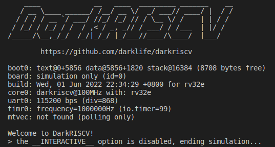

.. DarkRISCV documentation master file, created by
   sphinx-quickstart on Wed Jun  1 09:55:02 2022.
   You can adapt this file completely to your liking, but it should at least
   contain the root `toctree` directive.

欢迎阅读 DarkRISCV 文档！
=====================================
DarkRISCV 是 `Marcelo Samsoniuk <https://github.com/samsoniuk>`_ 在一个夜晚从零开始设计完成的 RISC-V 处理器。

   DarkRISCV-darksocv

DarkRISCV的源代码托管在 `github@darkriscv <https://github.com/darklife/darkriscv>`_ 上，你可以随时下载学习，或者用于你自己的项目中。

欢迎指正
=====================================
本文档的源代码托管在 `github@darkriscv-docs <https://github.com/vgegok/darkriscv-docs>`_ 上，
如果你在文档页面发现任何错误，都可以提交 `issue <https://github.com/vgegok/darkriscv-docs/issues>`_ 讨论和指正。

.. toctree::
   :maxdepth: 2
   :hidden:
   :caption: 了解 DarkRISCV

   introduction

.. toctree::
   :maxdepth: 2
   :hidden:
   :caption: 环境搭建

   environment

.. toctree::
   :maxdepth: 2
   :hidden:
   :caption: 快速开始

   quickstart

.. toctree::
   :maxdepth: 2
   :hidden:
   :caption: 资料和教程

   tutorials

Indices and tables
==================

* :ref:`genindex`
* :ref:`modindex`
* :ref:`search`
