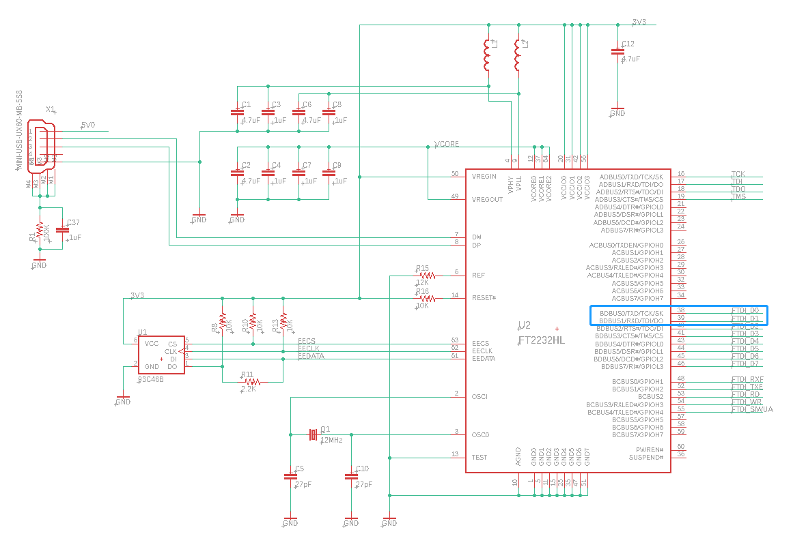

.. DarkRISCV documentation master file, created by
   sphinx-quickstart on Wed Jun  1 09:55:02 2022.
   You can adapt this file completely to your liking, but it should at least
   contain the root `toctree` directive.

0. RV32I 指令集
============================================
**RISC-V通用寄存器组**
--------------------------------------------

.. figure:: /images/RV32I_registers.png
   :align: center
   :alt: DarkRISCV-darksocv

   RISC-V通用寄存器组

**RV32I基础指令集列表**
--------------------------------------------

.. figure:: /images/RV32I_ISA_list.png
   :align: center
   :alt: DarkRISCV-darksocv

   RV32I基础指令集列表

**RV32I基础指令集详解**
--------------------------------------------

======== ========= ========= ========= ========= ========= =================================== ===================== ======================================================================
DARISCV   指令类型   指令      opcode    funct7    funct3    英文全称                            汇编格式                指令含义
======== ========= ========= ========= ========= ========= =================================== ===================== ======================================================================
LUI       U         LUI       0110111    /         /         Load Upper Immediate               lui rd, imm            将imm的值左移12位，存入rd
AUPIC     U         AUIPC     0010111    /         /         Add Upper Immediate to PC          auipc rd, imm          将imm的值左移12位加上PC，存入rd
JAL       J         JAL       1101111    /         /         Jump And Link                      jal rd, imm            跳转到（PC+imm）,rd用于存储返回值（PC+4），rd=zero则返回值不能被存储
JALR      I         JALR      1100111    /         0         Jump And Link-Register             jalr rd, rs1, imm      跳转到（rs1+imm）,rd用于存储返回值（PC+4），rd=zero则返回值不能被存储
BCC       B         BEQ       1100011    /         0         Branch on Equal                    beq rs1, rs2, imm      如果寄存器rs1和rs2的值相等，则PC值跳转到（PC+imm）
BCC       B         BNE       1100011    /         1         Branch on Not Equal                bne rs1, rs2, imm      如果寄存器rs1和rs2的值不相等，则PC值跳转到（PC+imm）
BCC       B         BLT       1100011    /         4         Branch on Less Than                blt rs1, rs2, imm      对rs1，rs2的值进行有符号比较，rs1<rs2，则PC值跳转到（PC+imm）
BCC       B         BGE       1100011    /         5         Branch on Greater than or Equal    bge rs1, rs2, imm      对rs1，rs2的值进行有符号比较，rs1>=rs2，则PC值跳转到（PC+imm）
BCC       B         BLTU      1100011    /         6         Branch on Less Than Unsigned       bltu rs1, rs2, imm     对rs1，rs2的值进行无符号比较，rs1<rs2，则PC值跳转到（PC+imm）
BCC       B         BGEU      1100011    /         7         Branch on Greater than or Equal U  bgeu rs1, rs2, imm     对rs1，rs2的值进行无符号比较，rs1>=rs2，则PC值跳转到（PC+imm）
LCC       I         LB        0000011    /         0         Load Byte                          lb rd, imm(rs1)        将地址（rs1+imm）中8bits数据取出，进行符号扩展后存入rd寄存器
LCC       I         LH        0000011    /         1         Load Halfword                      lh rd, imm(rs1)        将地址（rs1+imm）中16bits数据取出，进行符号扩展后存入rd寄存器
LCC       I         LW        0000011    /         2         Load Word                          lw rd, imm(rs1)        将地址（rs1+imm）中32bits数据取出，并存入rd寄存器
LCC       I         LBU       0000011    /         4         Load Byte Unsigned                 lbu rd, imm(rs1)       将地址（rs1+imm）中8bits数据取出，进行无符号扩展后存入rd寄存器
LCC       I         LHU       0000011    /         5         Load Hex Unsigned                  lhu rd, imm(rs1)       将地址（rs1+imm）中16bits数据取出，进行无符号扩展后存入rd寄存器
SCC       S         SB        0100011    /         0         Store Byte                         sb rs2, imm(rs1)       将rs1寄存器中的低8位值写入地址（rs1+imm）
SCC       S         SH        0100011    /         1         Store Halfword                     sh rs2, imm(rs1)       将rs1寄存器中的低16位值写入地址（rs1+imm）
SCC       S         SW        0100011    /         2         Store Word                         sw rs2, imm(rs1)       将rs1寄存器中的值写入地址（rs1+imm）
MCC       I         ADDI      0010011    /         0         ADDition Immediate                 add rd, rs1, imm       立即数加法，将寄存器rs1中的值和imm相加，结果存到rd寄存器，imm——12位
MCC       I         SLTI      0010011    /         2         Set Less Than Immediate            slt rd, rs1, imm       如果rs1寄存器中的值小于imm的值，则将rd寄存器设置设置位1，否则设置为0
MCC       I         SLTIU     0010011    /         3         Set Less Than Immediate Unsigned   slt rd, rs1, imm       如果rs1寄存器中的值小于imm的值，则将rd寄存器设置设置位1，否则设置为0
MCC       I         XORI      0010011    /         4         XOR Immediate                      xori rd, rs1, imm      将rs1寄存器中的值和imm进行异或运算后存入rd寄存器，imm——12位
MCC       I         ORI       0010011    /         6         OR Immediate                       ori rd, rs1, imm       将rs1寄存器中的值和imm进行或运算后存入rd寄存器，imm——12位
MCC       I         ANDI      0010011    /         7         AND Immediate                      andi rd, rs1, imm      将rs1寄存器中的值和imm进行与运算后存入rd寄存器，imm——12位
MCC       I         SLLI      0010011    0         1         Shift Left Logical Immediate       slli rd, rs1, imm      向左逻辑位移，将rs1寄存器中的值向左逻辑位移imm位存入rd寄存器，imm小于32
MCC       I         SRLI      0010011    0         5         Shift Right Logical Immediate      srli rd, rs1, imm      向右逻辑位移，将rs1寄存器中的值向右逻辑位移imm位存入rd寄存器，imm小于32
MCC       I         SRAI      0010011    32        5         Shift Right Arithmetic Immediate   srai rd,rs1,imm        向右算数位移，将rs1寄存器中的值向右算数位移imm位存入rd寄存器，imm小于32
RCC       R         ADD       0110011    0         0         ADDition                           add rd, rs1, rs2       寄存器加法，将寄存器rs1和rs2中保存的值相加，结果存到rd寄存器
RCC       R         SUB       0110011    32        0         SUBtraction                        sub rd, rs1, rs2       寄存器减法，用寄存器rs1的值减去寄存器rs2的值，结果存到rd寄存器
RCC       R         SLL       0110011    0         1         Shift Left Logical                 sll rd, rs1,rs2        向左逻辑位移，将rs1寄存器中的值向左逻辑位移rs2中的值存入rd寄存器，imm小于32
RCC       R         SLT       0110011    0         2         Set Less Than                      slt rd, rs1, rs2       如果rs1寄存器中的值小于rs2寄存器中的值，则将rd寄存器设置设置位1，否则设置为0
RCC       R         SLTU      0110011    0         3         Set Less Than Unsigned             sltu rd, rs1, rs2      如果rs1寄存器中的值小于rs2寄存器中的值，则将rd寄存器设置设置位1，否则设置为0
RCC       R         XOR       0110011    0         4         eXclusive OR                       xor rd, rs1, rs2       将rs1和rs2寄存器中的值进行异或运算后存入rd寄存器
RCC       R         SRL       0110011    0         5         Shift Right Logical                srl rd, rs1, rs2       向右逻辑位移，将rs1寄存器中的值向右逻辑位移rs2中的值存入rd寄存器，imm小于32
RCC       R         SRA       0110011    32        5         Shift Right Arithmetic             sra rd, rs1, rs2       向右算数位移，将rs1寄存器中的值向右算数位移rs2中的值存入rd寄存器，imm小于32
RCC       R         OR        0110011    0         6         OR                                 or rd, rs1, rs2        将rs1和rs2寄存器中的值进行或运算后存入rd寄存器
RCC       R         AND       0110011    0         7         AND                                and rd, rs1, rs2       将rs1和rs2寄存器中的值进行与运算后存入rd寄存器
FCC       I         FENCE     0001111    /         0         FENCE                              fence                  存储器屏障
CCC       I         ECALL     1110011    /         0         Environment Call                   ecall                  生成环境调用，当产生异常时，mepc寄存器会被更新为ecall指令的PC值
CCC       I         EBREAK    1110011    /         0         Environment Break                  ebreak                 生成断点异常，当产生异常时，mepc寄存器会被更新为ebreak指令的PC值
======== ========= ========= ========= ========= ========= =================================== ===================== ======================================================================

1. 移植到其他开发板
============================================
这部分内容以移植DarkRISCV到scarab的 `miniSpart6-plus <https://github.com/scarabhardware/miniSpartan6-plus>`_ 开发板为例，指导你将DarkRISCV一直到你自己的开发板。

**拷贝现有的开发板文件**
-------------------------------------------

使用 AVNET Microboard LX9 作为模板，因为这是目前测试最多，最稳定的开发板。
新的开发板的文件夹命名规则如下：

 **品牌_开发板完整名称_FPGA芯片简称**

.. code-block:: shell

   cd boards
   cp -rp avnet_micrboard_lx9 scarab_minispart6-plus_lx9

**修改ISE工程文件 darksocv.xise**
--------------------------------------------

第342行：

.. code-block:: xml

   <property xil_pn:name="Verilog Macros" xil_pn:value="SCARAB_MINISPARTAN6_PLUS_LX9=1" xil_pn:valueState="non-default"/>

**修改darksocv.xst**
--------------------------------------------

.. code-block:: 

   set -tmpdir "../tmp"
   set -xsthdpdir "../tmp/"
   run
   -ifn ../boards/scarab_minispart6-plus_lx9/darksocv.prj
   -ofn darksocv
   -ofmt NGC
   -p xc6slx9-3ftg256
   -top darksocv
   -opt_mode Speed
   -opt_level 1

   -define SCARAB_MINISPARTAN6_PLUS_LX9=1

**修改darksocv.mk**
--------------------------------------------

.. code-block:: makefile

   BOARD  = scarab_minispart6-plus_lx9
   DEVICE = xc6slx9-3ftg256

**修改管脚约束文件darkriscv.ucf**
--------------------------------------------
管脚约束文件需要根据你所使用的开发板的原理图和你的个人需求修改，
比如 miniSpart6-plus 自带FT2232作为JTAG和串口使用，
所以可以把FT2232的PORTB作为普通串口连接到DarkRISCV作为调试接口：

   miniSpartan6-plus-sch

.. code-block:: verilog
   
   NET XCLK            LOC = K3 | PERIOD = 50MHz HIGH 50%;
   
   NET XRES            LOC = P12  | PULLDOWN; # PORTC10
   
   NET UART_RXD        LOC = M7;
   NET UART_TXD        LOC = N6;

   NET LED[3]          LOC = P9;
   NET LED[2]          LOC = M9;
   NET LED[1]          LOC = N9;
   NET LED[0]          LOC = P11;
   
   NET DEBUG[3]        LOC = L14; # PORTC3
   NET DEBUG[2]        LOC = K14; # PORTC2
   NET DEBUG[1]        LOC = J12; # PORTC1
   NET DEBUG[0]        LOC = J13; # PORTC0

**修改rtl/config.vh配置文件**
--------------------------------------------
加入你所使用开发板的定义和时钟倍频、分频参数，以及RESET电平：

.. code-block:: verilog

   `ifdef SCARAB_MINISPARTAN6_PLUS_LX9
       `define BOARD_ID 13
       `define BOARD_CK_REF 50000000
       `define BOARD_CK_MUL 4
       `define BOARD_CK_DIV 2
       // `define INVRES 1               //复位引脚电平，高电平复位（运行时下拉）时无需定义
   `endif

**在src/io.h中加入开发板ID定义**
--------------------------------------------
比如我这里添加 `id==13 scarab minispartan6-plus lx9`

.. code-block:: c

   char *board_name(int id)
   {
       return id==0  ? "simulation only" : 
              id==1  ? "avnet microboard lx9": 
              id==2  ? "xilinx ac701 a200" :
              id==3  ? "qmtech sdram lx16" :
              id==4  ? "qmtech spartan7 s15" :
              id==5  ? "lattice brevia2 lxp2" :
              id==6  ? "piswords rs485 lx9" :
              id==7  ? "digilent spartan3 s200" :
              id==8  ? "aliexpress hpc/40gbe k420" :
              id==9  ? "qmtech artix7 a35" :
              id==10 ? "aliexpress hpc/40gbe ku040" :
              id==11 ? "papilio duo logicstart" :
              id==12 ? "qmtech kintex-7 k325" :
              id==13 ? "scarab minispartan6-plus lx9" :
                       "unknown";
   }

至此，DarkRISCV的移植工作已经完成，你可以使用以下命令生成bit流文件并下载到开发板进行测试：

.. code-block:: shell
   
   make install BOARD=scarab_minispart6-plus_lx9 <CROSS=riscv32-unknown-elf CCPATH=/opt/riscv/bin/ ARCH=rv32i/e HARVARD=1>

生成的bit流文件在tmp目录下，
针对miniSpart6-plus开发板，你可以使用 `miniSProg <https://github.com/vgegok/miniSProg.git>`_ 配置FPGA。

**运行效果如下：**

.. code-block:: 

       ____             __   ____  _________ _______    __
      / __ \____ ______/ /__/ __ \/  _/ ___// ____/ |  / /
     / / / / __ `/ ___/ //_/ /_/ // / \__ \/ /    | | / / 
    / /_/ / /_/ / /  / ,< / _, _// / ___/ / /___  | |/ /  
   /_____/\__,_/_/  /_/|_/_/ |_/___//____/\____/  |___/   
           https://github.com/darklife/darkriscv
   
   boot0: text@0+5856 data@5856+1820 stack@16384 (8708 bytes free)
   board: scarab minispartan6-plus lx9 (id=13)
   build: Thu, 02 Jun 2022 12:28:54 +0800 for rv32e
   core0: darkriscv@100MHz with: rv32e 
   uart0: 115200 bps (div=868)
   timr0: frequency=1000000Hz (io.timer=99)
   mtvec: not found (polling only)
   Welcome to DarkRISCV!
   > ?
   command: [?] not found.
   valid commands: clear, dump [hex], led [hex], timer [dec], gpio [hex]
                   mul [dec] [dec], div [dec] [dec], mac [dec] [dec] [dec]
                   reboot, wr[m][bwl] [hex] [hex] [[hex] when m],
                   rd[m][bwl] [hex] [[hex] when m]
   > dump 0
   00: 17 25 00 00 13 05 05 df 83 25 05 00 13 86 15 00 .%.......%......
   10: 23 20 c5 00 97 06 00 80 93 86 c6 fe 63 9e 05 06 # ..........c...
   20: 17 41 00 00 13 01 01 fe 97 21 00 00 93 81 41 5c .A.......!....A\
   30: ef 10 40 5c 17 25 00 00 13 05 05 d8 97 05 00 00 ..@\.%..........
   40: 93 85 45 fc 17 16 00 00 13 06 c6 69 33 06 b6 40 ..E........i3..@
   50: 97 16 00 00 93 86 06 69 17 27 00 00 13 07 47 da .......i.'....G.
   60: 33 07 d7 40 97 47 00 00 93 87 c7 f9 ef 00 10 49 3..@.G.........I
   70: 17 25 00 00 13 05 b5 d6 97 45 00 00 93 85 85 f8 .%.......E......
   80: 17 26 00 00 13 06 c6 d7 b3 85 c5 40 ef 00 10 47 .&.........@...G
   90: ef 00 00 14 6f f0 df f8 23 95 b6 00 93 85 15 00 ....o...#.......
   a0: 6f f0 9f ff 93 07 00 00 93 0f 10 00 33 85 ff 40 o...........3..@
   b0: 67 80 00 00 73 10 55 30 67 80 00 00 73 10 15 34 g...s.U0g...s..4
   c0: 67 80 00 00 73 10 45 30 67 80 00 00 13 05 00 00 g...s.E0g.......
   d0: 73 25 50 30 67 80 00 00 13 05 00 00 73 25 10 34 s%P0g.......s%.4
   e0: 67 80 00 00 13 05 00 00 73 25 40 30 67 80 00 00 g.......s%@0g...
   f0: 13 05 00 00 73 25 40 34 67 80 00 00 93 07 d0 00 ....s%@4g.......
   > 

.. note:: 
   我们已完成在miniSpart6-plus开发板上移植DarkRISCV的工作，如果你有一块miniSpart6-plus开发板，
   你可以直接下载并创建bit流文件进行测试。另外欢迎添加你自己的开发板到DarkRISCV项目中。
   
2. 在DarkRISCV运行CoreMark进行性能测试
============================================
